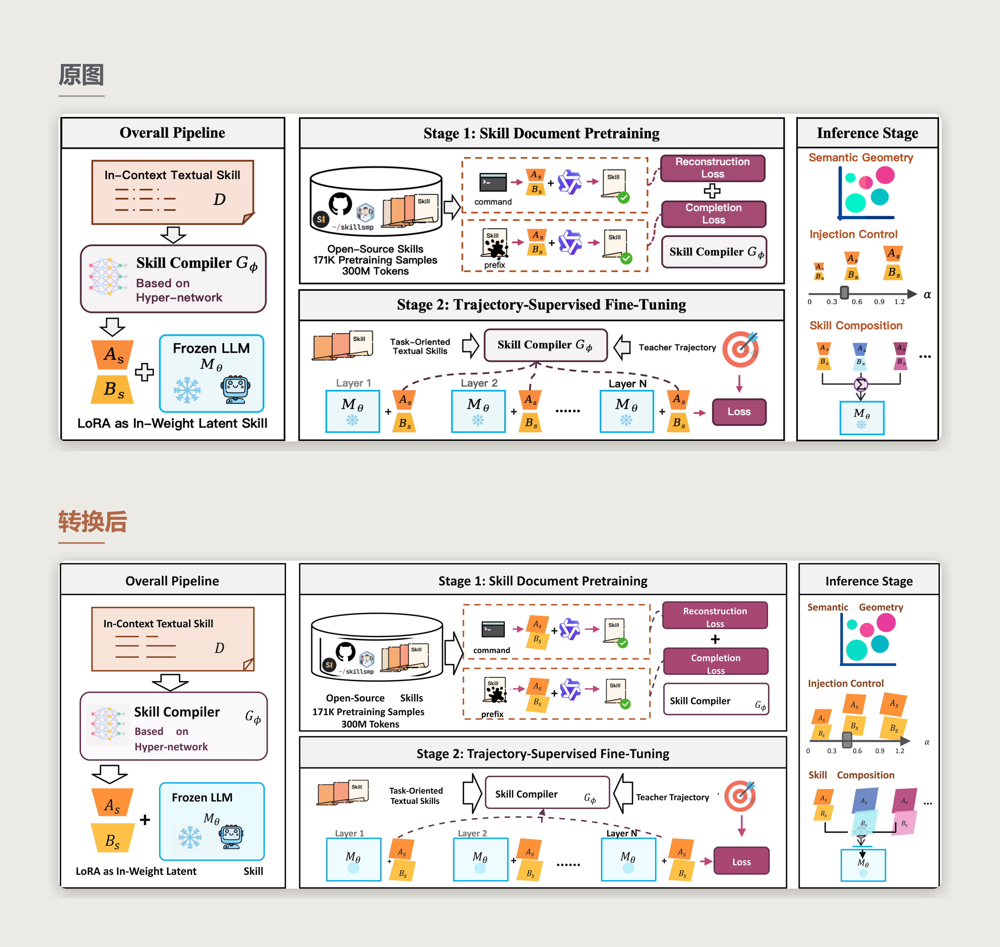
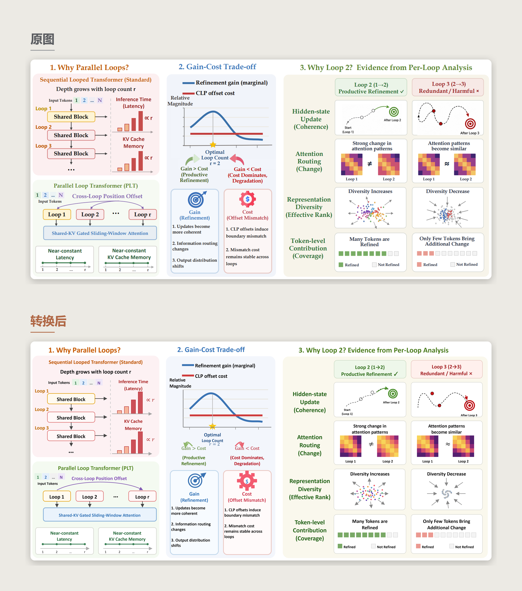
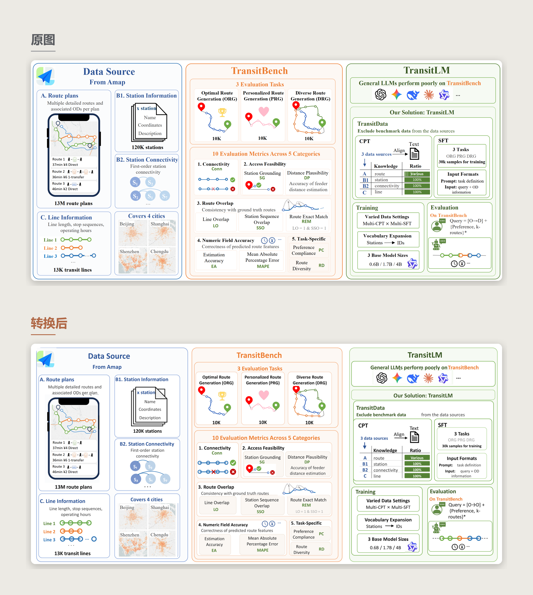
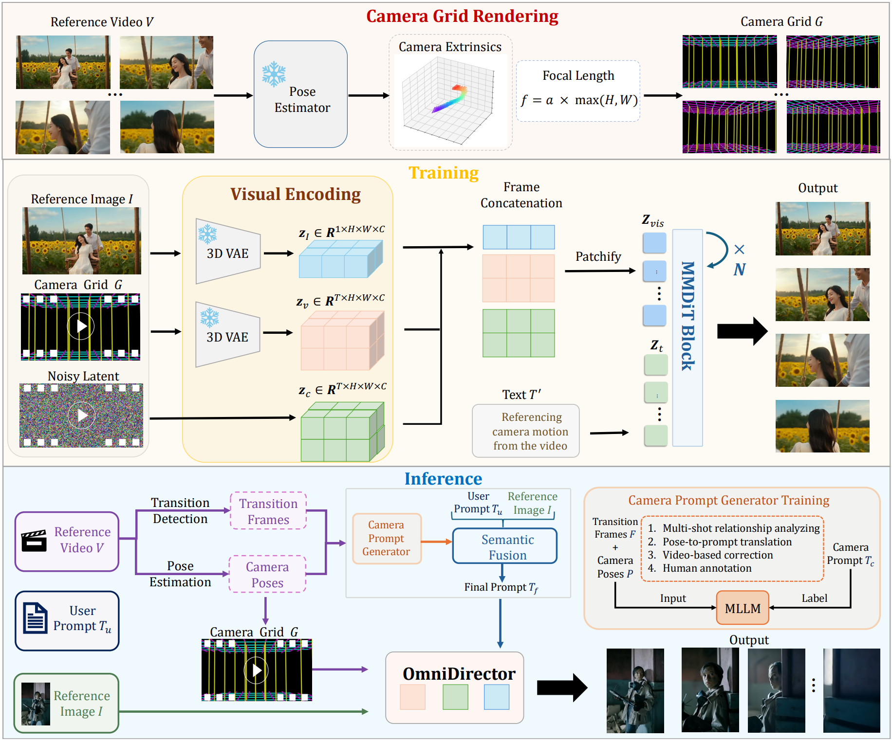
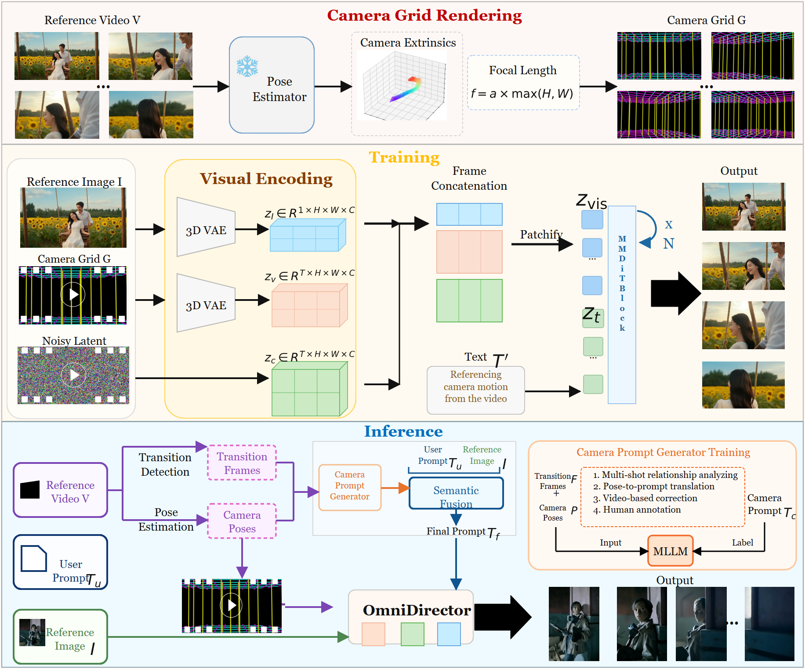
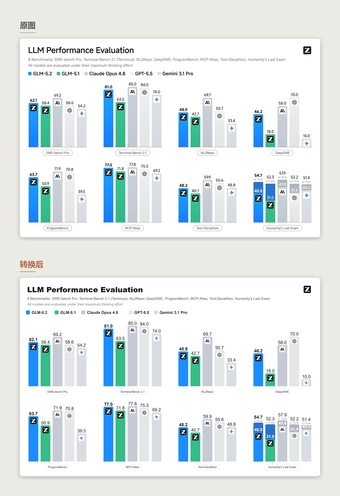

<div align="center">
  

  <h1>FigEdit · 图易编</h1>

  <p><strong>Make flattened figures editable again.</strong></p>

  <p>Rebuild screenshots, paper figures, diagrams, and AI-generated graphics as editable SVG and native PowerPoint.</p>

  <p>
    <a href="./README.md">中文</a> ·
    <a href="./README.en.md">English</a>
  </p>

  <p>
    <a href="https://www.python.org/"></a>
    <a href="./VERSION"></a>
    <a href="./LICENSE"></a>
  </p>

  <p>
    <a href="#examples">Examples</a> ·
    <a href="#quick-start">Quick start</a> ·
    <a href="#how-it-works">How it works</a> ·
    <a href="#acknowledgments-and-third-party-code">Acknowledgments</a>
  </p>
</div>

---

## What it does

FigEdit, also known in Chinese as 图易编, is an agent skill for rebuilding flattened images as editable graphics packages. Give it a screenshot, a paper figure, an AI-generated slide, a technical architecture diagram, or almost any other raster graphic. It separates the image into meaningful parts and reconstructs each part in the form that is most useful to edit:

- labels become real text;
- panels, borders, arrows, and connectors become vector shapes;
- formulas become semantic math and editable PowerPoint equations;
- photos, maps, screenshots, logos, and distinctive visual elements remain replaceable cropped assets.

The result is not merely an auto-traced image. It is a structured package that can be relabeled, rearranged, and restyled.

## Where it helps

### AI-generated graphics that look good but cannot be edited

Slides and architecture diagrams generated by tools such as GPT Image 2 or Nano Banana can look polished, but every element is baked into pixels. FigEdit reconstructs the layout as actual PowerPoint elements, so text boxes can be edited, shapes can be moved, and backgrounds can be replaced.

### Paper figures worth adapting

When a published figure has a useful frame, layout, shape language, or color system, FigEdit can rebuild that structure without forcing you to redraw the whole figure by hand. Labels can be changed and elements replaced in seconds instead of rebuilding the figure from scratch.

### Lost or unavailable source files

If the editable source of a designed infographic has been lost or was never shared, FigEdit can recover much of its structure from the flattened image. Frames become vectors, readable labels become selectable text, and source-specific icons or imagery are preserved as clean crops.

## Examples

Each image below compares the source figure with the FigEdit reconstruction.

### 1. Slide-layout decomposition


[Open the complete case: source, SVG, PPTX, manifest, and quality reports](./assets/examples/genai-history/)

### 2. Mixed icons and diagram structure



[Open the complete case: source, SVG, PPTX, manifest, and quality reports](./assets/examples/skill-compiler/)

### 3. Full vector redraw



[Open the complete case: source, SVG, PPTX, manifest, and quality reports](./assets/examples/parallel-loops/)

### 4. Asset-heavy reconstruction


[Open the complete case: source, SVG, PPTX, manifest, and quality reports](./assets/examples/tryon-pipeline/)

### 5. Mixed-element reconstruction



[Open the complete case: source, SVG, PPTX, manifest, and quality reports](./assets/examples/transitlm/)

### 6. Formula-rich reconstruction


[Open the complete case: source, SVG, PPTX, manifest, and quality reports](./assets/examples/ast-reveal/)

### 7. Mixed formulas and raster evidence





[Open the complete case: source, SVG, PPTX, manifest, and quality reports](./assets/examples/camera-grid-rendering/)

### 8. Grouped data-chart reconstruction



[Open the complete case: source, SVG, PPTX, manifest, and quality reports](./assets/examples/llm-performance-evaluation/)

## Why use it?

Turning a flattened image back into an editable document is not only a matter of recognizing what appears in the image. The harder problem is deciding which representation best preserves each element. Existing approaches solve different parts of the problem, but each has clear limitations:

| Approach | Representative projects | Core method | Main strengths | Main limitations |
| --- | --- | --- | --- | --- |
| Contour-fitting vectorization | Potrace, VTracer, Illustrator Image Trace | Fit Bézier curves to pixel colors and boundaries, converting the complete image into vector paths | Fast and inexpensive; well suited to logos, line art, silhouettes, and flat icons | Does not understand text, formulas, or relationships between elements. Complex images produce large numbers of fragmented paths that are technically vector but difficult to edit |
| OCR text overlay | OCR-to-PPT tools and some image-to-slide products | Keep the original image or image blocks, then overlay editable text boxes at matching positions | Simple to implement, visually faithful, and allows direct text editing | Graphics and structure remain rasterized. Original text may remain in the background and become visible after moving the overlay, so only part of the result is editable |
| Visual understanding and code reconstruction | Draw.io, Excalidraw, TikZ, AutoFigure-Edit, Draw with Thought | Use a multimodal model to understand the image, then generate structured SVG, Draw.io, Excalidraw, or TikZ code | Text, nodes, arrows, and connections are editable; effective for regular flowcharts and architecture diagrams | Code-based representations favor regular geometry. Custom icons, logos, photos, maps, and screenshots may be simplified, omitted, or replaced |
| End-to-end image-to-SVG | StarVector, VFig, dots.mocr-svg, RLRF | Use a specially trained model to generate complete SVG code or a sequence of vector primitives directly from the image | Highly automated and capable of producing path-level vector objects | Usually requires specialized models and GPUs. Complex images produce very long SVGs; photos, textures, and proprietary visual elements may lose fidelity, and generalization is constrained by training data |
| Element decomposition and structured assembly | Edit-Banana, CraftEditor | Use segmentation, OCR, generative cleanup, and related methods to separate text and visual elements, then assemble them into layered Draw.io, SVG, PSD, or similar formats | Preserves richer visual content and supports object-level movement, replacement, and recomposition | The workflow is heavy and often depends on multiple models, external services, or a GPU environment; reconstruction of complex figures can still be weak |

FigEdit uses a hybrid reconstruction strategy:

- titles, ordinary labels, and annotations are reconstructed as editable text;
- formulas are treated as independent semantic objects and exported as editable Office Math equations in the native PPTX;
- panels, shapes, borders, arrows, and connection relationships are rebuilt as vector objects;
- logos, photos, screenshots, maps, complex icons, and other source-specific visuals are cropped directly from the source;
- the final package includes editable SVG, self-contained SVG with embedded assets, and a native editable PPTX.

Once the dependencies are installed, give an image to the agent in one sentence. It can run the complete analysis, decomposition, reconstruction, export, and quality-check pipeline.

## How it works

The workflow has four stages: measure, decide, compose, and validate.

### 1. Measure

PaddleOCR locates text candidates, while OpenCV detects lines, rectangles, arrows, and other geometric evidence. The scripts also sample colors and style information. These measurements guide reconstruction; they do not automatically become final elements.

### 2. Decide

The agent classifies the figure and chooses a representation for every significant element.

| Element | Representation |
| --- | --- |
| Panels, arrows, grids, separators | Editable SVG shapes |
| Labels, titles, captions, legends | Editable text |
| Equations, variables, inline formulas | LaTeX-backed math and Office Math |
| Icons, photos, maps, charts, logos | Cropped and replaceable image assets |

For complex figures, the agent also chooses a reconstruction strategy: simple figures can be fully redrawn as vectors, mixed figures use hybrid reconstruction, multi-panel figures are decomposed panel by panel, and hand-drawn figures use semantic approximation. These strategies can be combined. A single panel may therefore use a vector frame, editable labels, semantic formulas, and preserved raster evidence.

Every decision is recorded in `manifest.json`, making the complete process reproducible.

### 3. Compose

The manifest is converted into the final package: vector structure, positioned text, rendered formulas, cropped image assets, SVG files, and a native PowerPoint file.

### 4. Validate

The audit checks for missing structure, text trapped inside image assets, failed formula conversion, weak editability, clipped crops, and export problems. The agent repairs the manifest and recomposes the package when necessary.

## Quick start

### Requirements

- Python 3.10+
- An AI agent environment that supports skills

Reconstruction quality depends heavily on the model's visual understanding and SVG drawing ability. Performance can vary significantly across models; Codex and Claude Code are the preferred environments.

| Agent environment | Recommended models | Notes |
| --- | --- | --- |
| **Codex** | GPT-5.5 | Preferred. Strong visual understanding, spatial reasoning, and tool-use capabilities |
| **Claude Code** | Claude Fable 5, with Claude Opus 4.8 as the second choice | Claude Fable 5 performed at least as well as GPT-5.5 in testing but is currently unavailable. Claude Opus 4.8 is usable, although its reconstruction of complex figures is weaker than GPT-5.5 |
| **Other mainstream agents** | GPT-5.5, Claude Opus 4.8, Gemini 3.5 | Avoid models that are strong at coding but lack image input or spatial visual reasoning. They may execute the FigEdit scripts yet still make obvious mistakes in element classification, crop boundaries, layer relationships, and layout judgment |

### Install

**Option 1: Install manually.** Clone the repository into the agent's skill directory, then install the dependencies:

```bash
# Clone into the Agent skill directory
git clone https://github.com/giszzt/figedit.git ~/.codex/skills/figedit

# Install the Python dependencies
pip install -r ~/.codex/skills/figedit/requirements.txt
```

**Option 2: Ask your agent to install it.** Send the repository URL to your agent with a request such as:

```text
Please install and configure this skill:
https://github.com/giszzt/figedit
```

### Use

Once installed, give the agent an image and describe the editable result you need:

```text
Turn this figure into an editable SVG package.
```

```text
Turn this image into an editable format.
```

```text
Vectorize this figure and reproduce its content accurately.
```

```text
I need to change several labels in this diagram. Convert it into an editable PPTX.
```

The agent should run the full measurement, reconstruction, export, and quality-check workflow in your project directory.

## Output package

```text
output/
├── editable.svg              # Editable SVG with linked assets
├── editable_embedded.svg     # Self-contained SVG with embedded assets
├── editable.pptx             # Native PowerPoint shapes and text boxes
├── preview.png               # Rendered preview
├── contact_sheet.png         # Overview of extracted raster assets
├── manifest.json             # Reconstruction plan
├── quality_report.md         # Quality checks and export status
├── editability_report.md     # Text-lift and asset-text audit
└── assets/                   # Cropped raster assets
```

## Project structure

```text
figedit/
├── SKILL.md            # Agent-facing workflow
├── README.md           # Chinese introduction
├── README.en.md        # English introduction
├── LICENSE
├── VERSION
├── THIRD_PARTY_NOTICES.md
├── requirements.txt
├── scripts/            # Measurement, composition, export, and audit tools
├── references/         # Reconstruction policies and authoring guidance
├── templates/          # Manifest schema and task templates
├── examples/           # Example prompts
└── assets/examples/    # Complete downloadable reconstruction cases
```

## Dependencies

| Package | Version | Purpose |
| --- | --- | --- |
| opencv-python | >= 4.9 | Structural detection |
| paddleocr | >= 3.7 | OCR using PP-OCRv6 |
| paddlepaddle | >= 3.3 | PaddleOCR backend |
| Pillow | >= 10.0 | Image processing |
| numpy | >= 1.24 | Array operations |
| scipy | >= 1.10 | Spatial analysis |
| matplotlib | >= 3.7 | Preview rendering |
| latex2mathml | >= 3.81 | Formula conversion |
| lxml | >= 5.0 | SVG and XML processing |

## Contributing

Issues and improvements are welcome, especially for complex layouts, formula export, OCR correction, and PowerPoint compatibility.

## Acknowledgments and third-party code

FigEdit's native SVG-to-PPTX export layer is adapted from [PPT Master](https://github.com/hugohe3/ppt-master). Thanks to Hugo He for open-sourcing its native, element-by-element editable PowerPoint conversion work. FigEdit extends and integrates that work for single-figure reconstruction, manifest-driven assets, editable equations, and reconstruction quality checks.

PPT Master is licensed under the MIT License. Its copyright notice, complete license text, and a description of the integration are preserved in [THIRD_PARTY_NOTICES.md](./THIRD_PARTY_NOTICES.md). FigEdit is an independent project and is not affiliated with or endorsed by PPT Master or its author.

## License

FigEdit's original code is available under the [MIT License](./LICENSE). Third-party components remain under their respective licenses; see [THIRD_PARTY_NOTICES.md](./THIRD_PARTY_NOTICES.md).
