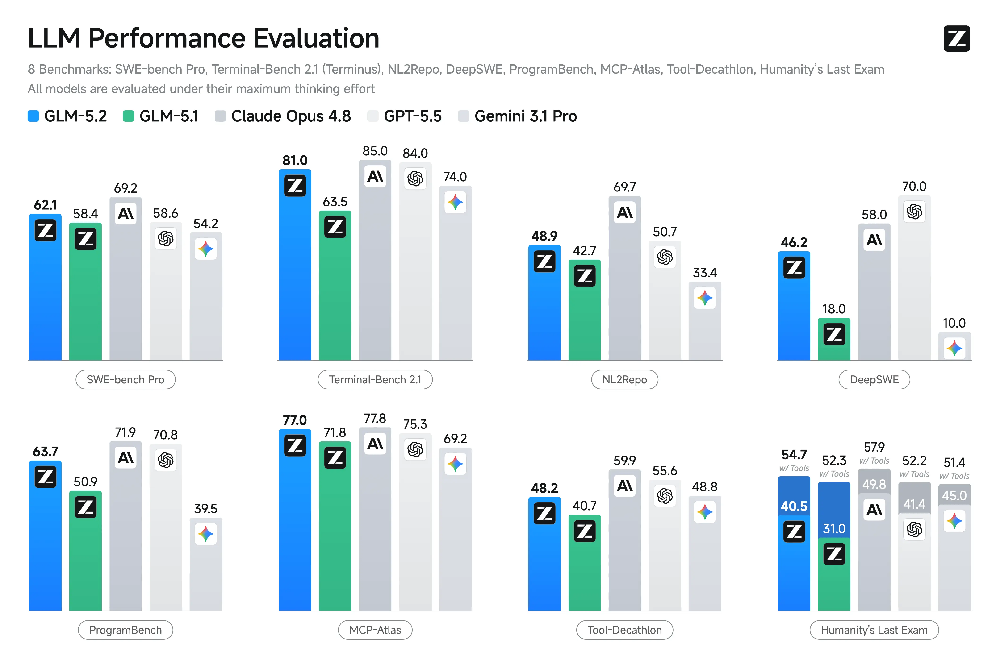
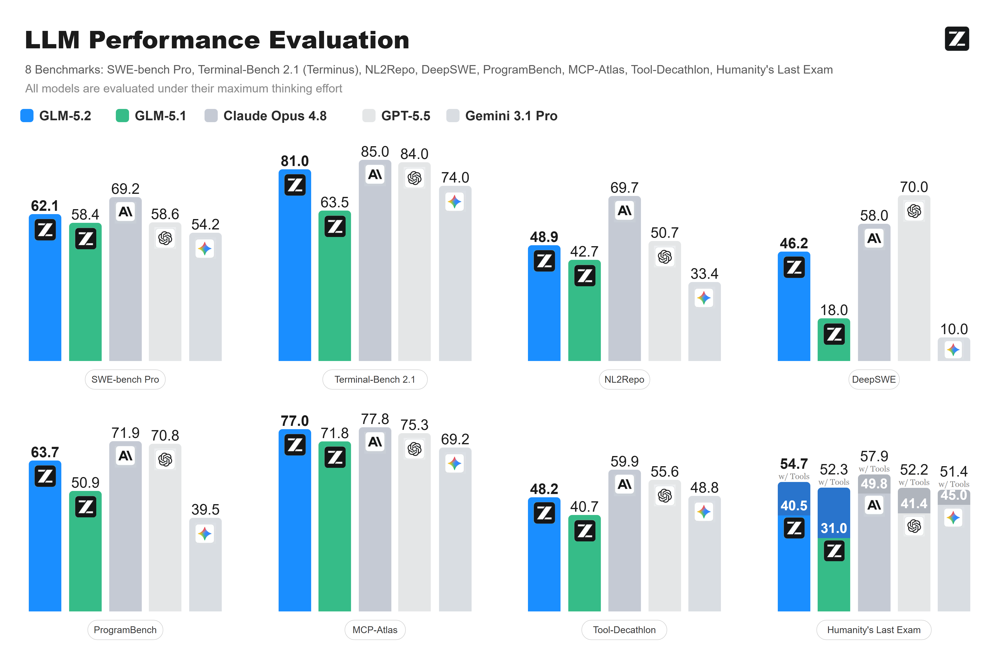

# LLM Performance Evaluation / 大模型性能评估图表

这个案例展示了多分组柱状图的重建。标题、图例、数值、坐标标签、柱体和分组结构均为可编辑对象，模型 Logo 作为可替换图片资产保留。

This case demonstrates the reconstruction of a grouped bar-chart dashboard. Titles, legends, values, labels, bars, and group structure are editable, while model logos remain replaceable image assets.

## Original / 原图

## Reconstructed preview / 重建预览

## Files / 文件

- [Editable SVG](./editable.svg)
- [Self-contained SVG / 内嵌资产 SVG](./editable_embedded.svg)
- [Native PowerPoint / 原生 PPTX](./editable.pptx)
- [Reconstruction manifest](./manifest.json)
- [Quality report](./quality_report.md)
- [Editability report](./editability_report.md)

The reconstruction contains 66 editable text elements, 93 structural vector elements, and 6 source-preserved logo assets.
